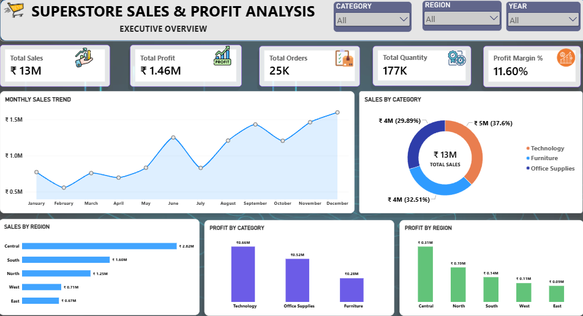
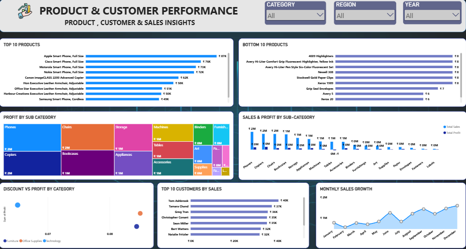

# Superstore Sales & Profit Analysis Dashboard

## 📊 Project Overview

This project is a **Superstore Sales & Profit Analysis** built using **SQL, Excel, and Power BI**.

The objective of this project is to analyze sales, profit, orders, quantity, customers, products, categories, and regional performance, and present the findings through an interactive **2-page Power BI dashboard**.

The project includes SQL analysis queries, cleaned Superstore data, and a Power BI dashboard designed for business insights.

---

## 🎯 Project Objectives

- Analyze overall sales and profit performance
- Compare sales and profit across categories and regions
- Understand monthly sales trends and growth
- Identify top and bottom performing products
- Analyze customer sales performance
- Understand the relationship between discount and profit
- Identify loss-making products
- Find top products within each category
- Find the best-performing product in each region
- Present key business KPIs in an interactive dashboard

---

## 🛠️ Tools & Technologies

| Tool | Purpose |
|---|---|
| **SQL / MySQL** | Data analysis and business queries |
| **Excel** | Cleaned dataset / data preparation |
| **Power BI** | Interactive dashboard and visualization |
| **DAX** | Measures and dashboard calculations |

---

# 📌 Dashboard 1 — Executive Overview

### Key KPIs

- **Total Sales:** ₹13M
- **Total Profit:** ₹1.46M
- **Total Orders:** 25K
- **Total Quantity:** 177K
- **Profit Margin:** 11.60%

### Visuals Included

- Monthly Sales Trend
- Sales by Category
- Sales by Region
- Profit by Category
- Profit by Region
- Category, Region, and Year slicers

### Key Dashboard Observations

- **Technology** is the highest sales-generating category with approximately **₹5M** in sales.
- **Technology** also generates the highest category profit at approximately **₹0.66M**.
- **Central** is the highest-performing region in both sales and profit.
- Monthly sales show an overall increasing pattern toward the end of the year.
- The dashboard provides a quick executive-level view of overall business performance.

---

# 📌 Dashboard 2 — Product & Customer Performance

### Visuals Included

- Top 10 Products by Sales
- Bottom 10 Products by Sales
- Profit by Sub-Category
- Sales & Profit by Sub-Category
- Discount vs Profit by Category
- Top 10 Customers by Sales
- Monthly Sales Growth
- Category, Region, and Year slicers

### Key Dashboard Observations

- The dashboard identifies the **highest-selling products** and allows comparison between top and bottom products.
- **Phones** and **Copiers** are among the stronger sub-categories based on the displayed profit analysis.
- The customer analysis highlights the top customers based on sales contribution.
- Monthly sales growth helps identify periods of increase and decrease in sales performance.
- Discount vs Profit provides a view of how discount levels relate to profitability.

---

## 🧮 SQL Analysis

The SQL file contains **20 business analysis queries**, including:

1. Total Sales
2. Total Profit
3. Total Orders
4. Total Quantity
5. Sales by Category
6. Profit by Category
7. Sales by Region
8. Profit by Region
9. Monthly Sales
10. Year-wise Performance
11. Top 10 Products by Sales
12. Bottom 10 Products by Sales
13. Loss-making Products
14. Top Customers
15. Discount vs Profit
16. Top 3 Products in Each Category
17. Customers with Sales Above Average
18. Monthly Sales Growth
19. Profit Margin by Category
20. Best-performing Product in Each Region

The SQL analysis uses aggregations such as `SUM()`, `COUNT()`, `AVG()`, `GROUP BY`, `HAVING`, `ORDER BY`, and `LIMIT`.

It also uses advanced SQL concepts such as **CTEs** and **window functions (`ROW_NUMBER()` and `LAG()`)** for ranking and month-over-month growth analysis.

---

## 📈 Business Insights

Based on the dashboard:

- The business generated approximately **₹13M in total sales**.
- Total profit is approximately **₹1.46M**, resulting in an overall profit margin of **11.60%**.
- Technology is the leading category by sales and profit.
- Central is the strongest region in the displayed sales and profit analysis.
- Sales generally increase toward the later months of the year.
- Product-level analysis helps identify both high-performing and low-performing products.
- Customer-level analysis helps identify customers contributing the most sales.
- Discount analysis can be used to evaluate the effect of discounts on profitability.

---

## 📂 Project Files

```text
Superstore-Sales-Profit-Analysis/
│
├── Superstore_Cleaned_Data.xlsx
├── Superstore_Analysis.sql
├── Superstore_Dashboard.pbix
├── README.md
│
└── 04_Screenshorts/
    ├── Dashboard_1_Sales_Profit.png
    └── Dashboard_2_Product_Customer.png
```

> **Note:** Note: Dashboard screenshots are available in the `04_Screenshots` folder in GitHub so the images displayed below work correctly.

---

## 🖼️ Dashboard Preview

### Dashboard 1 — Executive Overview



### Dashboard 2 — Product & Customer Performance



---

## 🔄 Project Workflow

```text
Superstore Dataset
       ↓
Data Cleaning / Preparation
       ↓
SQL Analysis
       ↓
Business Questions & KPIs
       ↓
Power BI Data Model
       ↓
DAX Measures
       ↓
Interactive Visualizations
       ↓
2-Page Business Dashboard
```

---

## 💡 Skills Demonstrated

- SQL data analysis
- Data cleaning and preparation
- Aggregate functions
- GROUP BY and HAVING
- CTEs
- Window functions
- Ranking analysis
- Month-over-month sales growth
- Power BI dashboard development
- DAX measures
- KPI design
- Data visualization
- Business insights and storytelling

---

## 👩‍💻 Project Summary

This project demonstrates how raw sales data can be transformed into meaningful business insights using **SQL and Power BI**.

The final dashboard provides a simple and interactive way for business users to monitor **sales, profit, products, customers, categories, regions, and monthly performance**.

---

## ⭐ Conclusion

The Superstore Sales & Profit Analysis dashboard provides an executive-level overview along with detailed product and customer performance analysis.

The combination of **SQL analysis + Power BI visualization** makes it possible to identify business trends, compare performance, and support data-driven decision-making.
